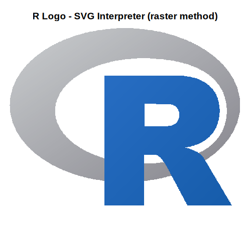

# R-svg-interpreter

- Visualize an SVG file with base R graphics
- Written with [Cursor](https://cursor.com/home)
- Tested with `Rlogo.svg`
- Two drawing methods:
  - `polygon` &ndash; faster; no gradients
  - `raster` &ndash; slower; with gradients

*Thanks to Barry Rowlingson for an [R-help message](https://stat.ethz.ch/pipermail/r-help/2025-June/481075.html) about how to approach drawing an SVG image in R. I used [that message as context](notes.md) for the first chat with Cursor.*

## Usage

Put `Rlogo.svg` and `svg_interpreter.R` in the working directory, then run these commands:

```r
source("svg_interpreter.R")

# Default is "polygon" method
plot_r_logo()
savePlot("Rlogo_polygon.png")

# Use darker colors
plot_r_logo(gradient_color = "middle")
plot_r_logo(gradient_color = "last")

# Draw gradients at high resolution
plot_r_logo(method = "raster", resolution = 600)
savePlot("Rlogo_raster.png")
```

<div align="center">
  
  
</div>

## Chat history

- [Chat 1](chat1.md) &ndash; R script for SVG interpretation and plotting
- [Chat 2](chat2.md) &ndash; Update code to use gradient colors

## Licenses

The R code in this repository was authored by Jeffrey Dick with AI assistance and is distributed under the MIT license.

Text attributed to Barry Rowlingson is taken from the [R-help mailing list](https://stat.ethz.ch/mailman/listinfo/r-help). The [R posting guide](https://www.r-project.org/posting-guide.html) says:

> Posters should be aware that the R lists are public discussion lists and anything you post will be archived and accessible via several websites for many years.

The [R logo](https://www.r-project.org/logo/) carries this text:

> The R logo is © 2016 The R Foundation.
> You can distribute the logo under the terms of the Creative Commons Attribution-ShareAlike 4.0 International license (CC-BY-SA 4.0) or (at your option) the GNU General Public License version 2 (GPL‑2).
